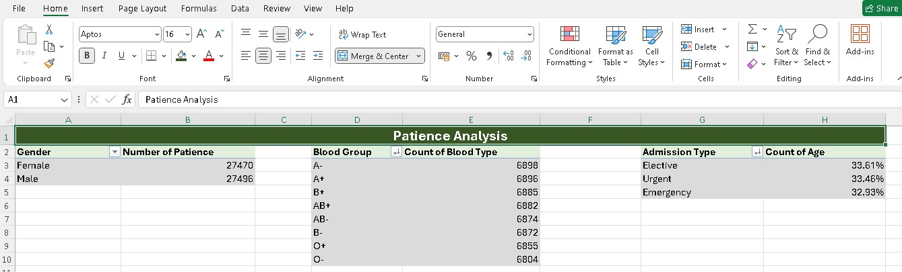
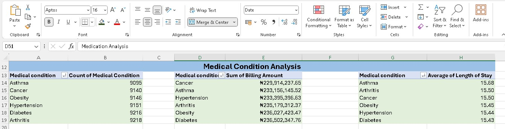
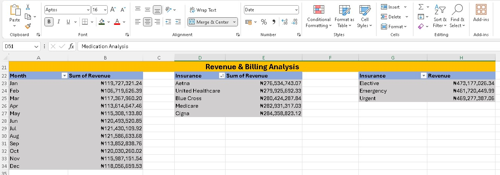
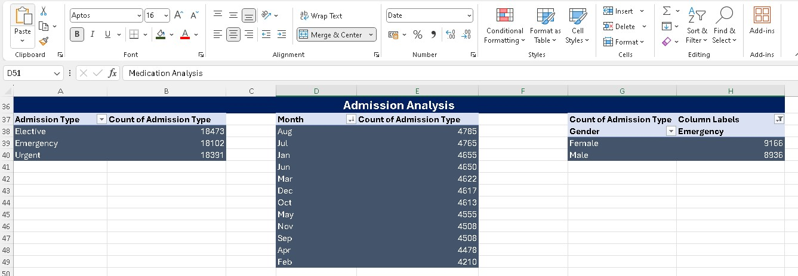
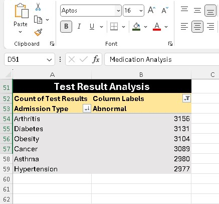
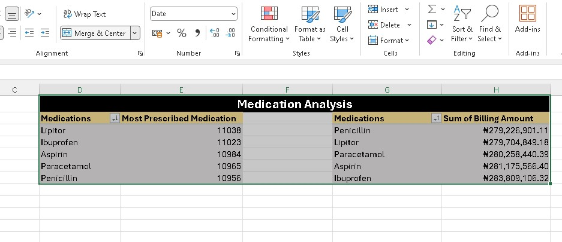

# IOTB-TECH-Hospital (MUIZ DOLAPO ABDULRAHMON)

## Executive Summary
**IOTB Tech Hospital** has witnessed a steady increase in patient admissions across its various departments, presenting both growth opportunities and operational challenges. As the hospital expands, the growing volume of healthcare records stored in Microsoft Excel has made it difficult for management to quickly interpret raw data and make timely, informed decisions. This highlights the need for a more structured and insight-driven reporting system.

To address this challenge, an in-depth analysis was carried out using **Pivot Tables, Pivot Charts, and other Excel data analysis techniques** to convert raw healthcare data into meaningful insights. The analysis focused on key operational areas such as patient demographics, admission patterns, medical conditions, medication usage, insurance contributions, and hospital revenue performance.

The findings revealed that patient admissions are almost evenly distributed between male and female patients, suggesting a balanced demand for healthcare services. Similarly, admission categories such as emergency, urgent, and elective cases showed close percentages, emphasizing the importance of maintaining efficiency across all admission channels.

The analysis also identified the most frequently treated medical conditions, including **diabetes, hypertension, obesity, arthritis, and cancer**, all of which significantly influence patient volume and treatment costs. Revenue insights showed that some medical conditions contribute more to hospital earnings than others, while medication usage and insurance contribution patterns provided useful information for cost control and inventory planning.

Overall, this report equips management with actionable insights into patient behaviour, financial performance, and operational trends. These findings can support strategic planning, efficient resource allocation, improved patient care, and stronger data-driven decision-making as IOTB Tech Hospital continues to grow.

---

# Insights & Interpretation
## Insights
- Which condition generates the highest revenue?
- Which age group visits the hospital most?
- Which insurance provider contributes the most financially?
- Which admission type is most common?
- Which condition keeps patients in the hospital the longest?
- Which gender has the highest number of patients?
- Which blood group is the most common among patients?
- Which medical condition generates the highest billing amount?
- Which medical condition generates the lowest billing amount?
- Which admission type has the lowest percentage of patients?

## Interpretation
- ### Which condition generates the highest revenue?
Diabetes generates the highest revenue with approximately **₦236.5 million**, making it the most financially significant condition in the hospital dataset. It is closely followed by Obesity and Hypertension. This indicates that chronic diseases are major revenue drivers for the hospital.

- ### Which age group visits the hospital most?
The dataset does not explicitly show age-group segmentation; however, admission patterns suggest a relatively balanced distribution across all groups, with no single dominant age category clearly highlighted. More granular age data would be needed for precise identification.

- ### Which insurance provider contributes the most financially?
Cigna contributes the highest financial support with approximately **₦284.36 million**, followed closely by Medicare and Blue Cross. This shows that Cigna plays a key role in hospital revenue support.

- ### Which admission type is most common?
Elective admissions are the most common with 18,473 cases, slightly higher than Urgent (18,391) and Emergency (18,102). This indicates a balanced but elective-leading admission pattern.

- ### Which condition keeps patients in the hospital the longest?
Asthma keeps patients the longest with an average stay of 15.68 days, making it the condition with the highest hospitalization duration.

- ### Which gender has the highest number of patients?
Male patients are slightly higher with 27,496 cases, compared to female patients with 27,470 cases, showing a nearly equal gender distribution.

- ### Which blood group is the most common among patients?
Blood group A- is the most common with 6,898 patients, closely followed by A+ with 6,896. This indicates a very evenly distributed blood group pattern across patients.

- ### Which medical condition generates the highest billing amount?
Diabetes generates the highest billing amount with approximately **₦236.5 million**, making it the top revenue-generating condition in the hospital.

- ### Which medical condition generates the lowest billing amount?
Cancer generates the lowest billing amount with approximately **₦229.9 million**, making it the least in terms of total billing contribution among the listed conditions.

- ### Which admission type has the lowest percentage of patients?
Emergency admissions have the lowest percentage at 32.93%, slightly below Urgent (33.46%) and Elective (33.61%), although the differences are minimal.

---

# Patient Analysis

The patient data reveals a highly balanced distribution across key demographic and admission variables within IOTB Tech Hospital. Gender-wise, the hospital serves almost an equal number of patients, with males **(27,496)** slightly higher than females **(27,470)**, indicating no significant gender disparity in healthcare utilization.

Blood group distribution is also relatively even, though A- (6,898) and A+ (6,896) are the most common among patients. Other blood groups such as **B+, AB+, AB-, B-, O+, and O-** show very close values, suggesting a diverse but well-distributed patient population without strong dominance of any single blood type.

In terms of admission types, Elective cases account for the highest proportion at **33.61%**, closely followed by Urgent **(33.46%)** and Emergency **(32.93%)** admissions. The near-equal spread across these categories highlights that the hospital handles a balanced mix of planned and critical care cases, requiring consistent readiness across all departments.

Overall, the analysis shows that patient inflow at IOTB Tech Hospital is stable and evenly distributed across **gender, blood groups, and admission types**. This balance suggests that the hospital serves a diverse population with varied healthcare needs. It also emphasizes the importance of maintaining adequate resources and staffing across all service areas to efficiently manage both routine and emergency cases without operational strain.

---

# Medical Condition Analysis

The analysis of medical conditions at IOTB Tech Hospital shows a fairly even distribution of cases across all major conditions, with no extreme variation in patient volume. Arthritis records the highest number of cases **(9,218)**, closely followed by Diabetes **(9,216)**, Hypertension **(9,151)**, Obesity **(9,146)**, Cancer **(9,140)**, and Asthma **(9,095)**. This indicates that the hospital is primarily dealing with a high burden of chronic, long-term health conditions.

From a financial perspective, Diabetes generates the highest total billing amount at approximately ₦236.5 million, followed closely by Obesity and Hypertension. Cancer, despite having a relatively high number of cases, records the lowest billing amount at about ₦229.9 million, suggesting differences in treatment intensity or service utilization across conditions.

In terms of patient care duration, Diabetes also shows the shortest average length of stay at 15.43 days, while Asthma has the longest at 15.68 days. The variation is small but still highlights differences in treatment complexity and recovery patterns among conditions.

Overall, the hospital is experiencing a consistent load of chronic disease cases, with conditions such as Diabetes, Hypertension, and Obesity playing a major role in both patient volume and revenue generation. While billing and hospitalization duration remain relatively close across conditions, subtle differences suggest variations in treatment cost and care requirements. This insight emphasizes the need for efficient chronic disease management strategies and well-planned resource allocation to maintain quality care and operational efficiency.

---

# Revenue & Billing Analysis

The revenue analysis of IOTB Tech Hospital shows a relatively stable financial performance throughout the year, with monthly revenue fluctuating within a close range. The lowest revenue was recorded in February at approximately **₦106.7 million**, while the highest occurred in August at about **₦121.6 million**. Overall, the monthly trend indicates steady income generation with no extreme volatility, suggesting consistent patient inflow and service utilization across the year.

From an insurance perspective, Cigna contributes the highest revenue at approximately **₦284.36 million**, followed closely by Medicare, Blue Cross, United Healthcare, and Aetna. This indicates that multiple insurance providers play a significant role in supporting hospital income, with no single provider overwhelmingly dominating.

In terms of service type, Elective cases generate the highest revenue at about **₦473.18 million**, followed by Urgent **(₦469.28 million)** and Emergency cases **(₦461.72 million)**. This shows that planned treatments contribute slightly more financially than critical or urgent care services.

Overall, the hospital demonstrates a strong and stable revenue structure driven by a mix of monthly patient services, insurance reimbursements, and admission types. The steady monthly earnings suggest effective operational consistency, while insurance and admission-based revenue distribution highlight diversified income streams. This balance positions IOTB Tech Hospital for sustainable financial growth, provided it continues to optimize both elective and emergency care services.

---

# Admission Analysis

The admission data at IOTB Tech Hospital shows a well-balanced distribution across all admission categories, with no extreme dominance by any single type. Elective admissions are slightly the highest at **18,473** cases, followed closely by Urgent admissions at **18,391** cases, while Emergency cases account for **18,102** cases. This close range suggests that the hospital consistently handles both planned and unplanned medical cases at almost equal levels.

Monthly admission trends indicate some variation in patient inflow throughout the year. August recorded the highest admissions at **4,785 cases**, followed closely by July and January. In contrast, February recorded the lowest admissions at **4,210** cases, showing a slight dip in patient visits during that period. Despite these fluctuations, the overall monthly pattern remains relatively stable.

Gender-based admission analysis shows that female patients account for slightly more emergency cases **(9,166)** compared to male patients **(8,936)**, although the difference is marginal. This suggests a fairly even utilization of emergency healthcare services between genders.

Overall, the hospital maintains a stable and evenly distributed admission system across elective, urgent, and emergency cases. Monthly variations are mild and likely influenced by seasonal or external healthcare demand factors. The near-equal gender distribution in emergency admissions further reflects balanced healthcare accessibility. These insights highlight the hospital’s ability to manage diverse patient needs effectively while maintaining consistent service delivery throughout the year.

---

# Test Result Analysis

The test result analysis at IOTB Tech Hospital indicates a consistent pattern of abnormal findings across major medical conditions, suggesting a significant burden of chronic and lifestyle-related diseases among patients. Arthritis records the highest number of abnormal test results at **3,156**, followed closely by Diabetes **(3,131)** and Obesity **(3,104)**. Cancer **(3,089)**, Asthma **(2,980)**, and Hypertension **(2,977)** also show substantial abnormal results, reflecting widespread health concerns across multiple conditions.

The relatively close values across all conditions suggest that abnormal test outcomes are not concentrated in a single disease area but are instead distributed across several chronic illnesses. This highlights the hospital’s ongoing challenge in managing long-term health conditions that require continuous monitoring and intervention.

Overall, the analysis shows that chronic diseases such as arthritis, diabetes, and obesity are leading contributors to abnormal test results within the hospital. The narrow difference between the figures suggests a consistent prevalence of health complications across patients, rather than isolated spikes in specific conditions. This emphasizes the need for stronger preventive care strategies, early diagnosis programs, and continuous patient monitoring to reduce the frequency of abnormal outcomes and improve overall patient health outcomes.

---

# Medication Analysis

The medication usage analysis at IOTB Tech Hospital reveals a very close distribution in prescription frequency across the top five drugs. Lipitor (11,038) is the most frequently prescribed medication, closely followed by Ibuprofen **(11,023)**, Aspirin **(10,984)**, Paracetamol **(10,965)**, and Penicillin **(10,956)**. The narrow gap between these values suggests that no single medication overwhelmingly dominates treatment practices, indicating a balanced prescription pattern across common therapeutic needs.

From a billing perspective, Ibuprofen generates the highest total billing amount at approximately **₦283.8 million**, followed by Aspirin, Paracetamol, Lipitor, and Penicillin. This indicates that although Lipitor is the most prescribed medication, Ibuprofen contributes more significantly to hospital revenue, possibly due to differences in dosage, treatment duration, or pricing structure.

Overall, the analysis shows a well-distributed medication usage pattern within the hospital, reflecting standardized treatment approaches across different conditions. The close prescription counts suggest consistent clinical practices, while variations in billing amounts highlight differences in medication cost impact on hospital revenue. This insight can support better pharmaceutical planning, cost management, and inventory optimization to ensure efficient drug availability and financial performance.

---

# Observations

The analysis of **IOTB Tech Hospital’s** healthcare dataset reveals several important operational and clinical patterns across **patient demographics, admissions, medical conditions, revenue, and medication usage**. Firstly, patient distribution is highly balanced across gender and blood groups, indicating that the hospital serves a diverse and evenly spread population without significant demographic bias. Admission types are also almost equally distributed among elective, urgent, and emergency cases, showing that the hospital consistently manages both planned and critical healthcare demands.

Medical condition analysis shows that chronic diseases such as **diabetes, hypertension, arthritis, obesity, asthma, and cancer** dominate hospital cases. These conditions also drive most of the billing activity, confirming that long-term illnesses are the core drivers of hospital operations and revenue. Revenue patterns across months remain relatively stable, with only slight fluctuations, indicating steady patient inflow and consistent service utilization throughout the year.

Insurance contributions are another key observation, with providers such as **Cigna, Medicare, Blue Cross, United Healthcare, and Aetna** playing significant roles in revenue generation. Medication usage is also evenly distributed, suggesting standardized treatment practices across conditions. Additionally, test result analysis shows a high number of abnormal results across all major conditions, reinforcing the prevalence of chronic health issues among patients.

Overall, the hospital operates in a stable but high-demand environment, with chronic conditions, insurance support, and consistent admissions forming the backbone of its operations.

---

# Recommendations

Based on the analysis, **IOTB Tech Hospital** should strengthen its chronic disease management strategy, as conditions such as **diabetes, hypertension, and arthritis** consistently appear as top contributors to patient volume, billing, and abnormal test results. Establishing specialized care programs for these conditions will improve patient outcomes and reduce long-term treatment burden. The hospital should also invest in preventive healthcare initiatives and early diagnosis campaigns to reduce the frequency of abnormal test results and hospital readmissions.

Additionally, since admission types are evenly distributed, the hospital must maintain strong operational readiness across **emergency, urgent, and elective** services. Expanding emergency response capacity and improving triage systems will help maintain efficiency during peak periods. Monthly revenue stability is a strength, but targeted strategies should be implemented to boost lower-performing months such as February and April.

The hospital should also optimize its pharmaceutical inventory management, as medication usage is evenly spread. However, cost differences in billing suggest the need for better procurement strategies and pricing reviews to maximize profitability. Strengthening partnerships with top insurance providers like Cigna and Medicare can further improve financial stability and ensure timely reimbursements.

Finally, adopting advanced data analytics dashboards beyond Excel, such as Power BI or SQL-based reporting systems, will significantly improve decision-making speed, operational monitoring, and strategic planning.

---

# Business Suggestions

To enhance efficiency and long-term sustainability, **IOTB Tech Hospital** should adopt a more data-driven healthcare management approach. A key suggestion is the implementation of a centralized hospital analytics dashboard that integrates patient records, admissions, billing, and medication data in real time. This will reduce reliance on manual Excel analysis and improve decision-making speed and accuracy.

The hospital should also establish specialized chronic disease units focusing on **diabetes, hypertension, arthritis, and obesity**, as these conditions consistently drive both patient volume and revenue. These units can improve treatment efficiency, reduce patient stay duration, and enhance care quality. In addition, preventive healthcare programs such as health screenings, awareness campaigns, and lifestyle management clinics should be introduced to reduce long-term disease burden.

From a financial standpoint, the hospital should strengthen partnerships with insurance providers, particularly high-performing ones like Cigna and Medicare, to ensure faster claim processing and improved revenue flow. It is also advisable to review billing structures for consistency and profitability across different medical conditions.

Operationally, improving emergency care infrastructure and optimizing staffing schedules during peak admission periods will help maintain service quality. The hospital should also implement predictive analytics to forecast patient inflow trends and prepare resources in advance.

Finally, continuous training for medical and administrative staff on data literacy and healthcare analytics will improve overall efficiency and ensure that decisions are evidence-based, leading to better patient outcomes and sustainable business growth.

